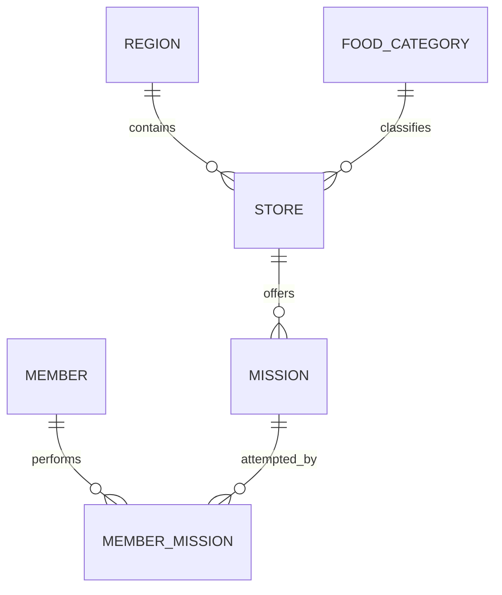

# 1주차 필수미션 최소 ERD 설계

## 목적

IA와 와이어프레임에서 필수로 지정된 로그인·회원가입, 지역·가게, 미션 목록·수행 내역을 저장할 수 있는 최소 관계형 데이터 모델을 정의한다.

지도·검색, 포인트 관리, 알림 설정, 사장님 점포 관리 기능은 범위에서 제외한다. 화면에서 확인되지 않은 기능이나 확장 가능성을 위한 테이블도 추가하지 않는다.

## 설계 원칙

- 테이블명과 컬럼명은 `snake_case` 소문자를 사용한다.
- 모든 테이블은 `id BIGINT AUTO_INCREMENT`를 기본키로 사용한다.
- FK는 자식 테이블에 두고 비식별 관계로 연결한다.
- 회원과 미션의 N:M 관계는 `member_mission`으로 해소한다.
- 필수값은 `NOT NULL`, 선택값만 `NULL`을 허용한다.
- 회원 탈퇴는 `deleted_at`을 이용한 Soft Delete로 처리한다.
- 조회로 계산 가능한 지역별 미션 완료 횟수와 포인트 잔액은 중복 저장하지 않는다.

## 관계 구조

관계의 의미는 다음과 같다.

- 하나의 지역에는 0개 이상의 가게가 있다.
- 하나의 음식 카테고리에는 0개 이상의 가게가 있다.
- 하나의 가게에는 0개 이상의 미션이 있다.
- 한 회원은 여러 미션을 수행할 수 있고, 한 미션도 여러 회원이 수행할 수 있다.
- 미션의 지역은 `mission → store → region`으로 판단하며 `mission.region_id`를 중복 저장하지 않는다.

## 테이블 명세

### member

로그인한 회원과 소셜 로그인 식별 정보를 저장한다. 이번 미션에서는 한 회원이 하나의 소셜 계정으로 가입한다고 단순화한다.

| 컬럼 | 타입 | 제약조건 | 설명 |
|---|---|---|---|
| `id` | `BIGINT` | PK, AUTO_INCREMENT | 회원 식별자 |
| `social_provider` | `VARCHAR(20)` | NOT NULL | 로그인 제공자. 예: `KAKAO` |
| `social_id` | `VARCHAR(255)` | NOT NULL | 제공자가 발급한 회원 식별자 |
| `nickname` | `VARCHAR(50)` | NOT NULL | 서비스에 표시할 회원명 |
| `created_at` | `DATETIME` | NOT NULL | 생성 시각 |
| `updated_at` | `DATETIME` | NOT NULL | 수정 시각 |
| `deleted_at` | `DATETIME` | NULL | 탈퇴 시각. 값이 있으면 탈퇴 회원 |

추가 제약조건:

- `UNIQUE (social_provider, social_id)`

### region

가게가 소속되는 지역을 저장한다.

| 컬럼 | 타입 | 제약조건 | 설명 |
|---|---|---|---|
| `id` | `BIGINT` | PK, AUTO_INCREMENT | 지역 식별자 |
| `name` | `VARCHAR(50)` | NOT NULL, UNIQUE | 지역명 |

### food_category

가게의 음식 분류를 저장한다. 필수 범위에서는 한 가게가 하나의 음식 카테고리에 속한다고 가정한다.

| 컬럼 | 타입 | 제약조건 | 설명 |
|---|---|---|---|
| `id` | `BIGINT` | PK, AUTO_INCREMENT | 카테고리 식별자 |
| `name` | `VARCHAR(50)` | NOT NULL, UNIQUE | 음식 카테고리명 |

### store

지역에 위치한 가게의 기본 정보를 저장한다.

| 컬럼 | 타입 | 제약조건 | 설명 |
|---|---|---|---|
| `id` | `BIGINT` | PK, AUTO_INCREMENT | 가게 식별자 |
| `region_id` | `BIGINT` | FK, NOT NULL | 가게가 속한 지역 |
| `food_category_id` | `BIGINT` | FK, NOT NULL | 가게의 음식 카테고리 |
| `name` | `VARCHAR(100)` | NOT NULL | 가게명 |

외래키:

- `region_id → region.id`
- `food_category_id → food_category.id`

### mission

특정 가게를 방문해 수행하는 미션을 저장한다.

| 컬럼 | 타입 | 제약조건 | 설명 |
|---|---|---|---|
| `id` | `BIGINT` | PK, AUTO_INCREMENT | 미션 식별자 |
| `store_id` | `BIGINT` | FK, NOT NULL | 미션 대상 가게 |
| `title` | `VARCHAR(100)` | NOT NULL | 미션 제목 |
| `description` | `VARCHAR(255)` | NOT NULL | 수행 조건 또는 설명 |
| `reward_point` | `INT` | NOT NULL | 미션 완료 시 표시되는 보상 포인트 |

외래키:

- `store_id → store.id`

`reward_point`는 미션 화면에 보상 포인트가 표시되는 경우에만 유지한다. IA·와이어프레임에 개별 미션 포인트가 없다면 삭제한다.

### member_mission

회원이 어떤 미션을 시작하거나 완료했는지 저장하는 중간 매핑 테이블이다.

| 컬럼 | 타입 | 제약조건 | 설명 |
|---|---|---|---|
| `id` | `BIGINT` | PK, AUTO_INCREMENT | 수행 내역 식별자 |
| `member_id` | `BIGINT` | FK, NOT NULL | 미션을 수행하는 회원 |
| `mission_id` | `BIGINT` | FK, NOT NULL | 수행 대상 미션 |
| `status` | `VARCHAR(20)` | NOT NULL | `IN_PROGRESS` 또는 `COMPLETED` |
| `started_at` | `DATETIME` | NOT NULL | 미션 시작 시각 |
| `completed_at` | `DATETIME` | NULL | 미션 완료 시각 |

외래키와 추가 제약조건:

- `member_id → member.id`
- `mission_id → mission.id`
- `UNIQUE (member_id, mission_id)`
- `status = 'COMPLETED'`일 때만 `completed_at`에 값을 저장한다.

## 핵심 조회 흐름

### 홈 화면의 지역별 가게

`region → store → food_category`를 조인하여 지역에 속한 가게와 음식 분류를 조회한다.

### 가게별 미션 목록

`store → mission`을 조인하여 선택한 가게의 미션 목록을 조회한다.

### 회원의 미션 수행 내역

`member → member_mission → mission → store`를 조인하여 회원의 진행 중·완료 미션과 대상 가게를 조회한다.

### 지역별 완료 미션 수

`member_mission → mission → store → region`을 조인하고, `member_id`, `region_id`, `status = 'COMPLETED'` 조건으로 완료 건수를 집계한다. 완료 건수가 10개인지 확인할 수 있지만, 포인트 지급과 포인트 이력은 이번 ERD 범위에 포함하지 않는다.

## ERDCloud 작성 기준

- 여섯 테이블을 위 관계 구조대로 배치한다.
- 모든 관계는 점선 비식별 관계로 연결한다.
- `member_mission`은 `member`와 `mission` 사이에 배치한다.
- PK, FK, NOT NULL, UNIQUE 제약조건을 표시한다.
- IA·와이어프레임에 실제로 표시되는 필수 데이터가 이 명세에 없다면 해당 컬럼만 추가한다.
- 화면에 없고 필수 기능에도 필요하지 않은 주소 상세, 전화번호, 이미지, 평점, 리뷰, 알림, 검색 기록 등은 추가하지 않는다.

## 제출용 미션 기록 순서

1. IA와 와이어프레임에서 필수 화면을 분류한다.
2. 각 화면에서 저장이 필요한 데이터를 표시한다.
3. 엔티티 후보를 `member`, `region`, `food_category`, `store`, `mission`, `member_mission`으로 정리한다.
4. 중복 컬럼을 제거하고 관계와 카디널리티를 결정한다.
5. ERDCloud에서 최종 ERD를 작성한다.
6. 설계 과정과 최종 ERD 이미지를 노션 미션 기록에 첨부한다.

## 확정 범위와 검증 포인트

이 설계의 테이블 범위는 여섯 개로 확정한다. 다만 `nickname`, `mission.description`, `mission.reward_point`처럼 화면 표시 여부에 따라 달라지는 속성은 IA·와이어프레임을 대조한 뒤 유지 여부를 최종 결정한다. 테이블이나 기능을 추가하기 전에 기존 관계로 요구사항을 충족할 수 있는지 먼저 확인한다.
