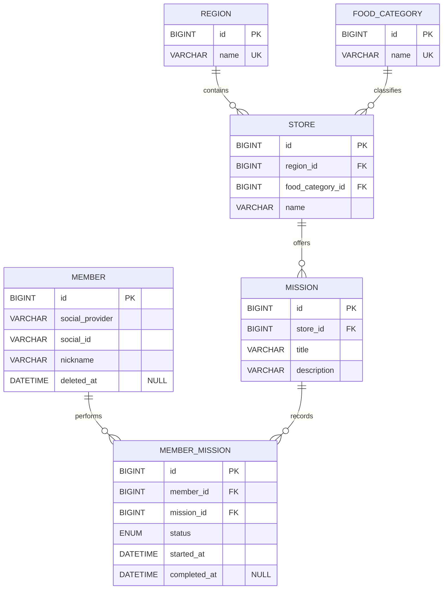

# 1주차 필수미션 ERD

필수 화면인 로그인·회원가입, 지역·가게, 미션 목록, 회원별 미션 수행 내역만 반영한 최소 ERD입니다.

## 관계

- `region 1 : N store`
- `food_category 1 : N store`
- `store 1 : N mission`
- `member 1 : N member_mission`
- `mission 1 : N member_mission`
- `member`와 `mission`의 N:M 관계는 `member_mission`이 해소합니다.

모든 관계는 자식 테이블의 독립적인 `id`를 PK로 사용하는 비식별 관계입니다. ERDCloud에서는 관계선을 점선으로 연결합니다.

## 핵심 설계 판단

- 소셜 로그인 정보는 필수 범위만 고려하여 `member`에 직접 저장합니다.
- 가게는 하나의 지역과 하나의 음식 카테고리에 속합니다.
- 미션의 지역은 `mission → store → region` 관계로 확인하므로 `mission`에 `region_id`를 중복 저장하지 않습니다.
- 회원별 미션 상태와 수행 시각은 `member_mission`에 저장합니다.
- `(social_provider, social_id)`에는 UNIQUE 제약조건을 둡니다.
- `(member_id, mission_id)`에는 UNIQUE 제약조건을 두어 같은 미션의 중복 참여를 막습니다.
- 회원 탈퇴는 `member.deleted_at`을 이용한 Soft Delete로 표현합니다.
- 지역별 완료 미션 수는 `member_mission → mission → store → region`을 조인해 계산합니다.
- 지도·검색, 포인트 이력, 알림 설정, 사장님 점포 관리 데이터는 포함하지 않습니다.

## ERDCloud 입력 순서

1. `member`, `region`, `food_category`를 생성합니다.
2. `store`를 만들고 `region_id`, `food_category_id`를 FK로 연결합니다.
3. `mission`을 만들고 `store_id`를 FK로 연결합니다.
4. `member_mission`을 만들고 `member_id`, `mission_id`를 FK로 연결합니다.
5. 모든 PK를 `id BIGINT Auto Increment`로 지정합니다.
6. `deleted_at`, `completed_at`만 NULL을 허용하고 나머지 컬럼은 NOT NULL로 지정합니다.

실제 MySQL DDL은 [schema.sql](./schema.sql)에 있습니다.

## 노션 미션 기록에 적을 내용

1. 필수 화면을 회원, 지역·가게, 미션, 미션 수행 내역으로 분류했습니다.
2. 회원과 미션의 관계가 N:M이므로 `member_mission` 중간 테이블을 두었습니다.
3. 지역과 음식 카테고리는 여러 가게를 가질 수 있도록 각각 `store`와 1:N으로 연결했습니다.
4. 미션의 지역은 가게를 통해 알 수 있어 중복 컬럼을 만들지 않았습니다.
5. 지역별 미션 10개 완료 여부는 완료 상태의 `member_mission`을 지역별로 집계하도록 설계했습니다.
